<p align="center">
  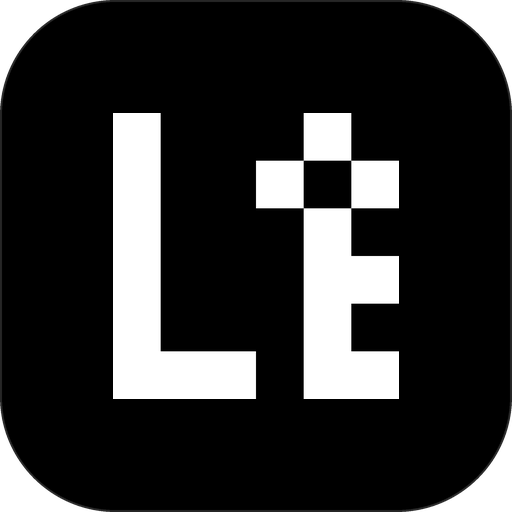
</p>

<h1 align="center">LiAuth</h1>

<p align="center">
  <b>Deine Codes. Dein Gerät. Sonst nichts.</b><br>
  Ein moderner Open-Source-Authenticator für Android, iOS, macOS und Windows.<br>
  Offline-first, Ende-zu-Ende-verschlüsselt, gebaut um einen gemeinsamen Rust-Kern.
</p>

<p align="center">
  <a href="https://github.com/liwidale/liauth/releases/latest"></a>
  <a href="https://github.com/liwidale/liauth/actions/workflows/ci.yml"></a>
  
  <a href="LICENSE"></a>
</p>

<p align="center"><a href="README.md">English</a> · <a href="README.ru.md">Русский</a> · Deutsch · <a href="README.es.md">Español</a> · <a href="README.fr.md">Français</a> · <a href="README.zh.md">简体中文</a></p>

## Was du bekommst

- **Einmalcodes.** Zeit- und zählerbasierte Codes (RFC 6238 TOTP, RFC 4226 HOTP) sowie Steam-Codes. Alles wird automatisch aus QR-Codes und Links erkannt; Profis können beim manuellen Anlegen eigene Parameter setzen (8 Stellen, SHA-256/SHA-512, eigenes Intervall).
- **System-Autofill auf Android.** Die App registriert sich als Autofill-Dienst, sodass Einmalcodes direkt in Login-Formularen angeboten werden.
- **Korrektur der Uhrabweichung.** Ein eingebauter SNTP-Client misst, wie weit die Geräteuhr abweicht, und korrigiert die Code-Erzeugung, ohne die Systemuhr anzufassen.
- **Tippfehler-tolerante Suche.** Unscharfes Matching findet „GitHub" auch bei „gthub", die Treffer werden in der Liste hervorgehoben.
- **Papierkorb.** Gelöschte Konten liegen 30 Tage im Bereich „Zuletzt gelöscht", bevor sie endgültig verschwinden. Ein versehentlicher Tipp kostet keinen Zugang.
- **Notizen und Wiederherstellungscodes.** Jedes Konto kann freie Notizen und eine Liste von Wiederherstellungscodes tragen, verschlüsselt zusammen mit den Geheimnissen.
- **Brute-Force-Schutz.** Fehlgeschlagene Entsperrversuche lösen eine progressiv wachsende Verzögerung aus, die App-Neustarts übersteht.
- **Offline-first.** Keine Cloud, keine Server, keine Konten. Alle Daten bleiben auf dem Gerät.
- **Starke Verschlüsselung.** Der Tresor ist mit AES-256-GCM versiegelt; der Schlüssel wird per Argon2id aus deinem Passwort abgeleitet. Geräteschlüssel schützen Android Keystore, der Apple-Schlüsselbund mit Secure-Enclave-Biometrie und der Windows-Anmeldeinformationsspeicher.
- **Biometrische Entsperrung.** Face ID auf iOS, Touch ID auf macOS, Fingerabdruck oder Gesicht auf Android, Schnellentsperrung auf Windows.
- **Lokale Synchronisierung.** Verschiebe Konten zwischen Geräten über dein eigenes WLAN. Geräte koppeln sich mit einem einmaligen 6-stelligen Code (SPAKE2), der Kanal ist Ende-zu-Ende mit AES-256-GCM verschlüsselt. Nichts verlässt je das lokale Netz.
- **Verschlüsselte Sicherungen.** Exportiere und importiere passwortgeschützte Sicherungsdateien, lege nach jeder Änderung automatisch eine verschlüsselte Kopie in einem Ordner deiner Wahl ab oder schiebe Sicherungen per WebDAV auf deine eigene Nextcloud/NAS — der Server sieht immer nur Chiffretext.
- **Import aus anderen Apps.** Google Authenticator (Migrations-QR), Aegis (offen und verschlüsselt), 2FAS (offen und verschlüsselt), Authy-Exporte, Microsoft-Authenticator-Konten über otpauth-Links und jede Liste von `otpauth://`-URIs.
- **Gruppen und Stapelaktionen.** Ordne Konten in eigene Gruppen wie Finanzen, Gaming, Social Media oder Entwicklung und lösche oder verschiebe viele Konten auf einmal.
- **Privatsphärenschutz.** Die App verbirgt ihren Inhalt im App-Umschalter und blockiert Screenshots und Bildschirmaufnahmen. Beides lässt sich in den Einstellungen abschalten.
- **Vollständig lokalisierbar.** Jeder Text liegt in JSON-Dateien. Englisch, Russisch, Deutsch, Spanisch, Französisch und vereinfachtes Chinesisch sind dabei, die Systemsprache wird automatisch erkannt und wechselt sofort ohne Neustart. Lege eine neue JSON-Datei in den `languages`-Ordner der App, um eine Sprache ohne Codeänderung hinzuzufügen.
- **Design auf Vercel-Niveau.** Eine minimale Dashboard-Oberfläche auf einem einzigen Designsystem für alle Plattformen: rein schwarzer Hintergrund, haarfeine #262626-Ränder, Inter-Typografie (400–700), Codes in JetBrains Mono, 4/6/8/12px-Radien, 36px-Bedienelemente, 150ms-Ease-out-Übergänge und null Schatten, Verläufe oder Glas. Animationen lassen sich komplett abschalten, und ein optionaler Markenmodus zeigt echte Dienstlogos ([Simple Icons](https://simpleicons.org), CC0) auf Markenfarben.

## Screenshots

### Android

<p>
  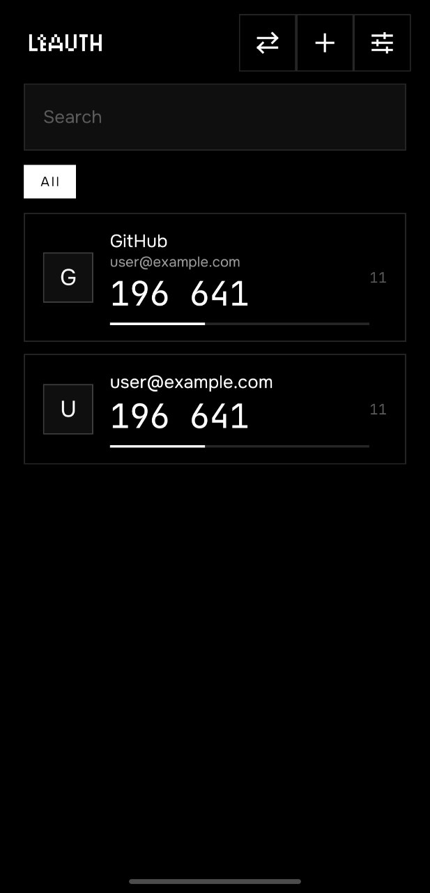
  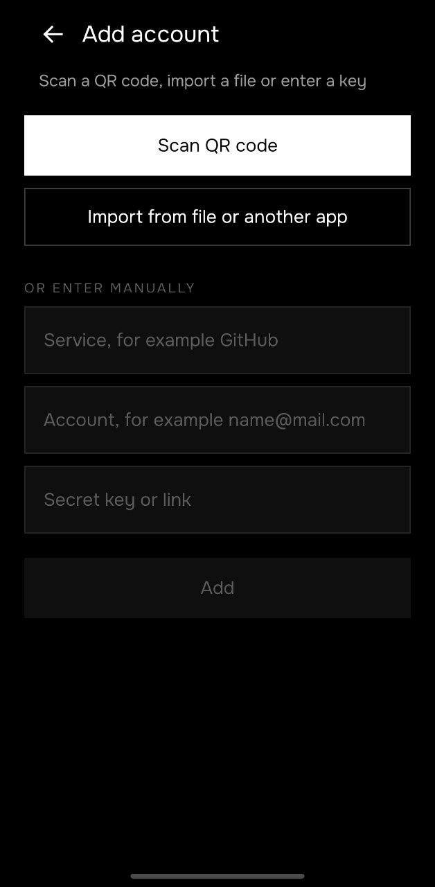
  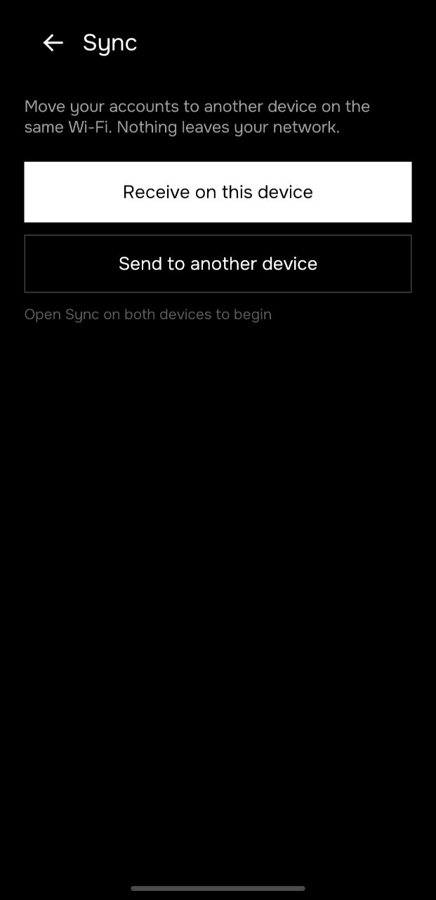
  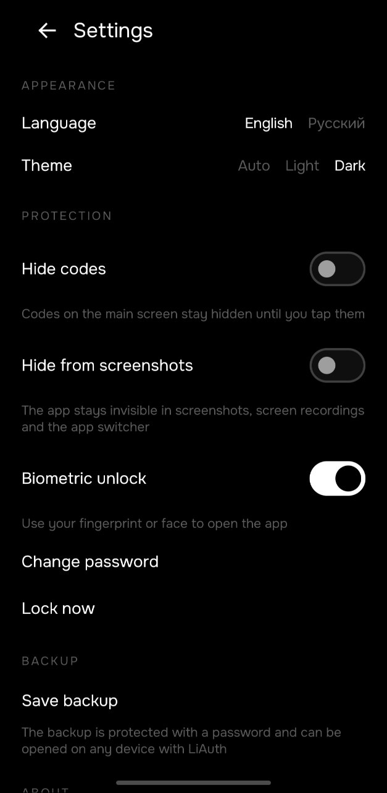
</p>

### Windows

<p>
  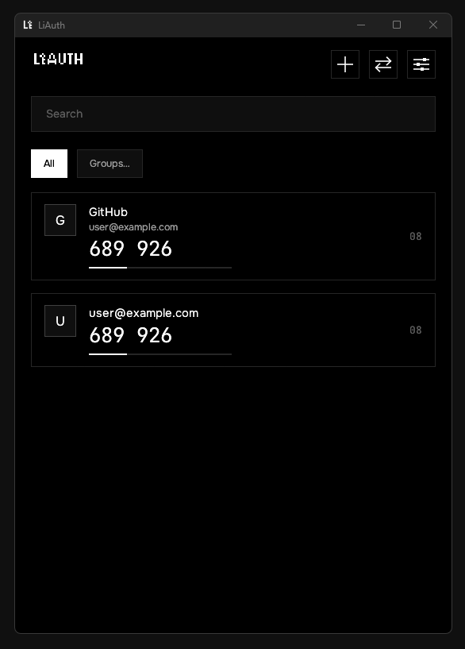
  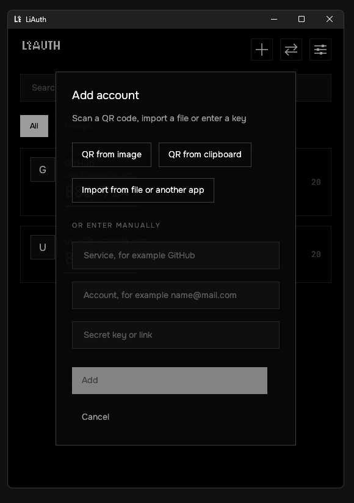
  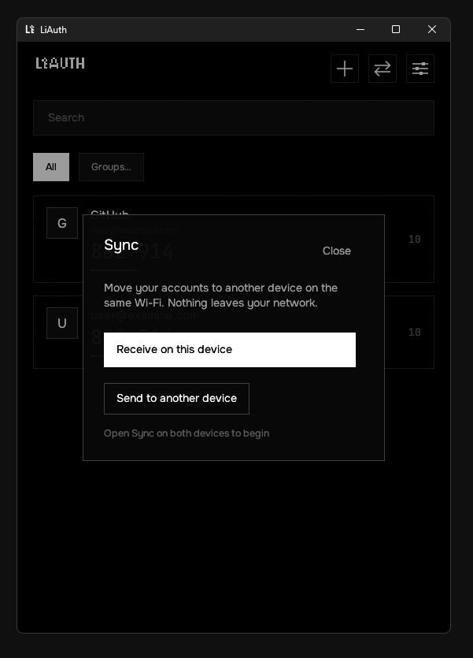
  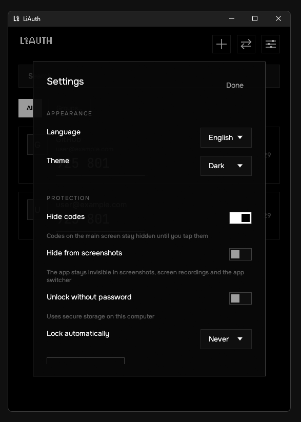
</p>

### macOS

<p>
  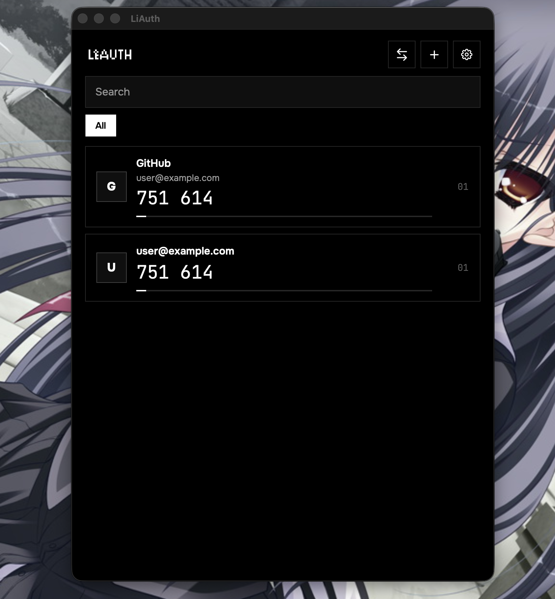
  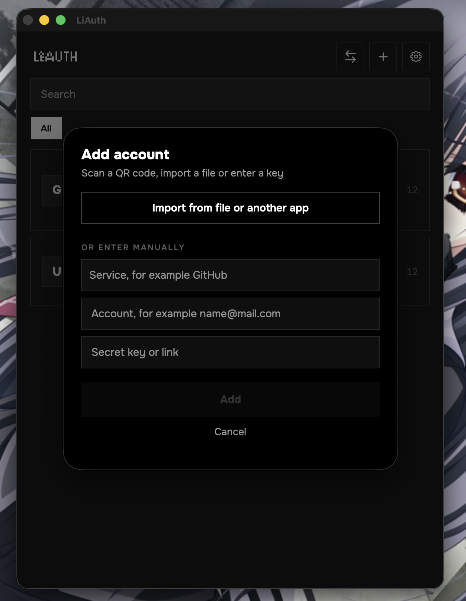
</p>
<p>
  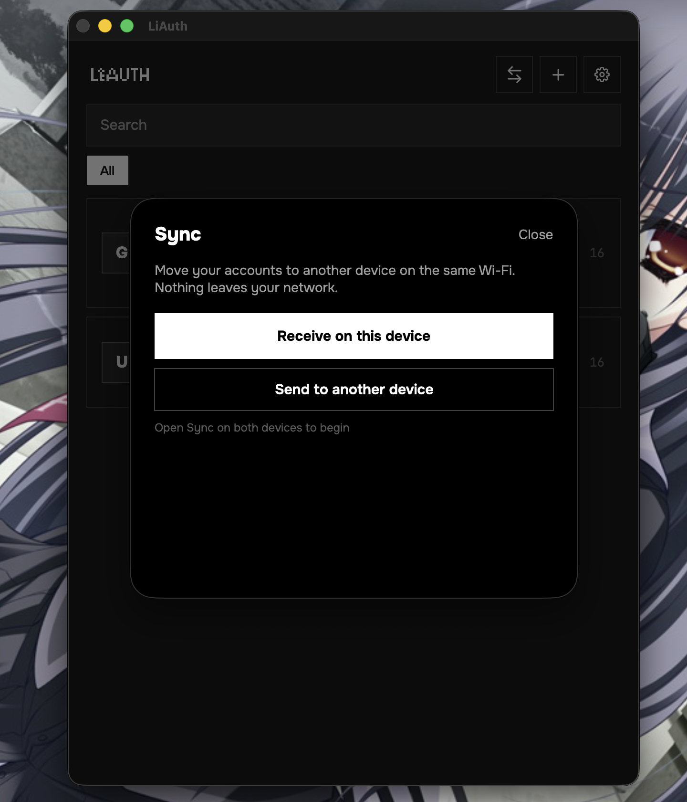
  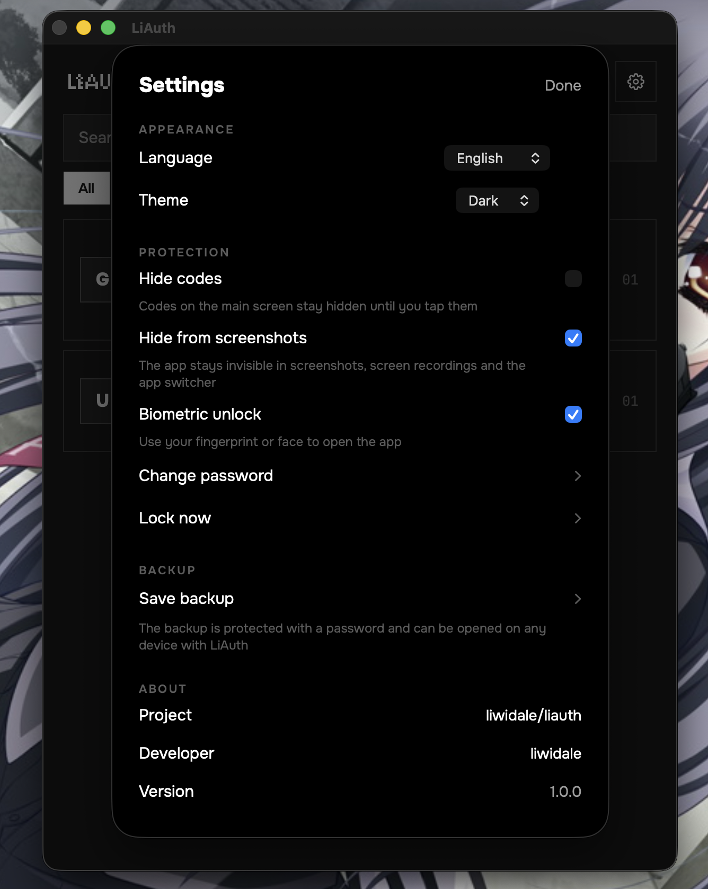
</p>

## Architektur

Die gesamte Geschäftslogik lebt in Rust und wird von allen Plattformen geteilt:

```
liauth
├── core/
│   ├── liauth-core      Codes (TOTP, HOTP, Steam), otpauth-URIs, Suche, SNTP
│   ├── liauth-crypto    AES-256-GCM-Umschläge, Argon2id-Schlüsselableitung, Schlüsselslots
│   ├── liauth-vault     Verschlüsselter Tresor, Gruppen, Einstellungen, Sicherungen, Zusammenführung
│   ├── liauth-import    Importer für Google Authenticator, Aegis, 2FAS, Authy
│   ├── liauth-sync      Lokale Synchronisierung: mDNS-Erkennung + SPAKE2-Kopplung
│   └── liauth-ffi       uniffi-Bindings für Kotlin und Swift
├── windows/             Windows-App (Rust + egui)
├── android/             Android-App (Kotlin + Jetpack Compose)
├── apple/               iOS- und macOS-Apps (Swift + SwiftUI, XcodeGen)
├── localization/        Gemeinsame JSON-Sprachdateien (en, ru, de, es, fr, zh)
├── branding/            Logo und Identitätskonfiguration
└── scripts/             Icon-Generierung und Werkzeuge
```

Der Tresor ist eine einzelne verschlüsselte Datei. Ein zufälliger 256-Bit-Datenschlüssel verschlüsselt den Inhalt; dieser Schlüssel steckt in einem oder mehreren *Schlüsselslots*: deinem Passwort (über Argon2id) und optional einem Geräteschlüssel in der sicheren Hardware der Plattform für die biometrische Entsperrung. Eine Passwortänderung versiegelt den Tresor neu und widerruft alle Geräteslots.

## Apps beziehen

Fertige Binärdateien hängen an jedem [Release](https://github.com/liwidale/liauth/releases): eine `.apk` für Android, eine `.dmg` für macOS, eine `.ipa` für iOS und eine `.exe` für Windows.

Die macOS- und Windows-Builds sind nicht mit einem kostenpflichtigen Entwicklerzertifikat signiert, daher zeigt das Betriebssystem beim ersten Öffnen unter Umständen eine Warnung. Für Open-Source-Software ohne kommerzielle Signatur ist das zu erwarten. Wer sich nicht auf heruntergeladene Binärdateien verlassen möchte, baut die Apps wie unten beschrieben aus dem Quellcode — die Release-Prüfsummen erlauben die Verifikation des Downloads.

## Aus dem Quellcode bauen

### Voraussetzungen

- Rust 1.85+ (`rustup`)
- Android: JDK 17, Android SDK + NDK, `cargo-ndk` (`cargo install cargo-ndk`)
- iOS / macOS: Xcode 15+, [XcodeGen](https://github.com/yonaskolb/XcodeGen) (`brew install xcodegen`)

### Kern

```sh
cargo test --workspace
```

### Windows

```sh
cargo build --release -p liauth-windows
# target/release/LiAuth.exe
```

### Android

```sh
cd android
gradle assembleRelease
# app/build/outputs/apk/release/app-release.apk
```

Der Gradle-Build kompiliert den Rust-Kern für alle Android-ABIs über `cargo-ndk` und erzeugt die Kotlin-Bindings automatisch.

### iOS und macOS

```sh
bash apple/scripts/build-xcframework.sh
cd apple
xcodegen generate
open LiAuth.xcodeproj
```

Baue das Schema `LiAuth-iOS` oder `LiAuth-macOS`.

## Lokalisierung

Sprachen liegen in [`localization/`](localization) als flache JSON-Dateien (`en.json`, `ru.json`, `de.json`, `es.json`, `fr.json`, `zh.json`). So fügst du eine Sprache hinzu:

1. Kopiere `en.json` nach `<code>.json` (zum Beispiel `it.json`).
2. Übersetze die Werte und setze `language.name` auf den Namen der Sprache in ihr selbst.
3. Öffne einen Pull Request oder lege die Datei auf deinem Gerät in den `languages`-Ordner der App — sie erscheint sofort in den Einstellungen, ohne Neubau.

## Branding

Die gesamte Grafik wird von zwei Dateien in [`branding/`](branding) gesteuert; ein komplettes Rebranding ist durch deren Austausch möglich:

```
branding/logo.png        1024 x 1024, PNG, transparenter Hintergrund — das App-Zeichen
branding/text.png        weiß auf transparentem PNG            — der LiAuth-Schriftzug
```

Das Zeichen speist die Android-Launcher-Icons, das Apple-Icon-Set, das Windows-Executable-Icon und die Grafik in der App; der Schriftzug erscheint auf Start- und Sperrbildschirm. Beide werden zur Laufzeit eingefärbt, sodass sich eine weiße Vorlage auf transparentem Grund automatisch an helles und dunkles Design anpasst.

Nach dem Austausch einer Datei `bash scripts/generate-icons.sh` ausführen (benötigt ImageMagick), um die Plattform-Icons neu zu erzeugen — oder einfach pushen, CI erledigt es automatisch. Die Pfade stehen in [`branding/branding.json`](branding/branding.json).

## Sicherheitsmodell

- Geheimnisse ruhen AES-256-GCM-verschlüsselt; Schlüssel werden mit Argon2id abgeleitet (64 MiB / 3 Iterationen auf dem Desktop, mobil angepasste Parameter auf Telefonen).
- Schlüsselmaterial wird nach Gebrauch im Speicher genullt.
- Die lokale Synchronisierung koppelt Geräte per SPAKE2 über einen einmaligen 6-stelligen Code, leitet einen Sitzungsschlüssel über HKDF-SHA256 ab und verschlüsselt jeden Frame mit AES-256-GCM. Ein falscher Code bricht die Sitzung ab; jeder Code funktioniert einmal.
- Sicherungen sind eigenständige verschlüsselte Umschläge mit derselben Konstruktion wie der Tresor.
- Keine Telemetrie, keine Analyse, kein Netzwerkzugriff außer der lokalen Synchronisierung, die du selbst startest.

Sicherheitslücke gefunden? Bitte eröffne ein privates Security Advisory auf GitHub statt eines öffentlichen Issues.

## Entwicklung

```sh
cargo fmt --all            # Formatierung
cargo clippy --workspace --all-targets -- -D warnings
cargo test --workspace     # 70 Unit-Tests, inklusive RFC-4226/6238-Vektoren
```

Das Repository bringt `.editorconfig`, `rustfmt.toml` und eine CI mit, die Formatierung, Lints und Tests bei jedem Push erzwingt.

## Lizenz

[MIT](LICENSE) © 2026 Liwidale

<p align="center"><sub>ゝ made by <a href="https://github.com/liwidale">liwidale</a></sub></p>
