<div align="center">

# 


**你的验证码。你的设备。仅此而已。**

一款面向 Android、iOS、macOS 和 Windows 的现代开源身份验证器。
离线优先，端到端加密，基于共享的 Rust 内核构建。

[](https://github.com/liwidale/liauth/actions/workflows/ci.yml)
[](LICENSE)


[English](README.md) · [Русский](README.ru.md) · [Deutsch](README.de.md) · [Español](README.es.md) · [Français](README.fr.md) · 简体中文

</div>

---

## 功能

- **一次性验证码** — 基于时间和计数器的验证码（RFC 6238 TOTP、RFC 4226 HOTP），以及 Steam 验证码。一切都能从二维码和链接中自动识别；高级用户在手动添加时仍可自定义参数（8 位、SHA-256/SHA-512、自定义周期）。
- **Android 系统自动填充** — 应用注册为系统自动填充服务，验证码直接出现在登录表单中。
- **时钟偏差校正** — 内置 SNTP 客户端测量设备时钟的偏差，并只校正验证码的生成，绝不修改系统时钟。
- **容错搜索** — 模糊匹配让你输入「gthub」也能找到「GitHub」，匹配的字符会在列表中高亮。
- **回收站** — 删除的账户会在「最近删除」中保留 30 天才永久消失，误触永远不会让你失去登录方式。
- **备注与恢复代码** — 每个账户都可以附加自由格式的备注和恢复代码列表，与密钥一起加密存储。
- **防暴力破解锁** — 解锁失败会触发逐步增长的延迟，且重启应用后依然生效。
- **离线优先** — 没有云、没有服务器、没有账号。所有数据都留在设备上。
- **强加密** — 保险库使用 AES-256-GCM 封装；密钥通过 Argon2id 从你的密码派生。设备解锁密钥由 Android Keystore、带 Secure Enclave 生物识别的 Apple 钥匙串以及 Windows 凭据存储保护。
- **生物识别解锁** — iOS 上的 Face ID、macOS 上的 Touch ID、Android 上的指纹或面容、Windows 上的快速解锁。
- **本地同步** — 通过你自己的 Wi-Fi 在设备间迁移账户。设备使用一次性 6 位代码（SPAKE2）配对，通道以 AES-256-GCM 端到端加密。任何数据都不会离开本地网络。
- **加密备份** — 导出和导入受密码保护的备份文件；每次更改后自动在你选择的文件夹保存加密副本；或通过 WebDAV 推送到你自己的 Nextcloud/NAS——服务器只能看到密文。
- **从其他应用导入** — Google Authenticator（迁移二维码）、Aegis（明文和加密）、2FAS（明文和加密）、Authy 导出、通过 otpauth 链接的 Microsoft Authenticator 账户，以及任何 `otpauth://` URI 列表。
- **分组与批量操作** — 将账户整理到自定义分组（金融、游戏、社交、开发等），并可一次删除或移动多个账户。
- **隐私保护** — 应用在任务切换器中隐藏内容，并阻止截图和录屏。两者都可在设置中关闭。
- **完全可本地化** — 所有文本都在 JSON 文件中。默认提供英语、俄语、德语、西班牙语、法语和简体中文，自动检测系统语言，切换即时生效无需重启。把新的 JSON 文件放进应用的 `languages` 文件夹即可添加语言，无需改动代码。
- **Vercel 级设计** — 全平台统一设计系统的极简仪表盘风格界面：纯黑背景、#262626 发丝级边框、Inter 字体（400–700）、JetBrains Mono 验证码、4/6/8/12px 圆角、36px 控件、150ms ease-out 过渡，没有阴影、渐变和毛玻璃。动画可完全关闭，可选的品牌图标模式会在品牌色背景上显示真实的服务标志（[Simple Icons](https://simpleicons.org)，CC0）。

## 截图

### Android

<p>
  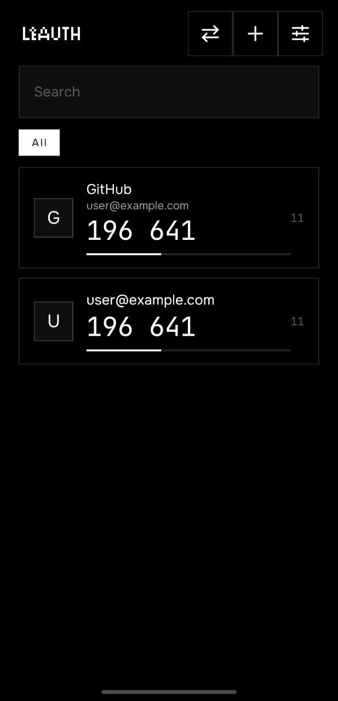
  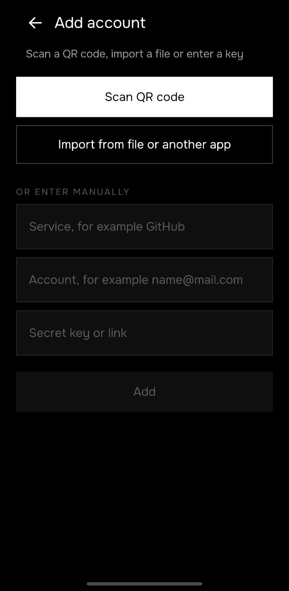
  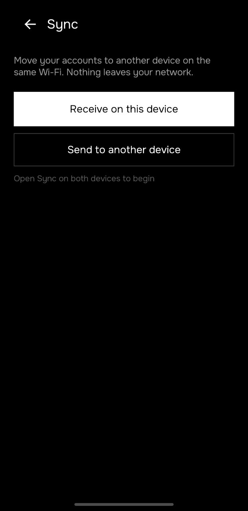
  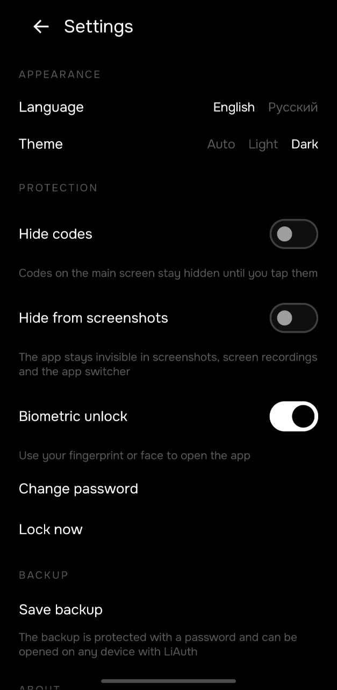
</p>

### Windows

<p>
  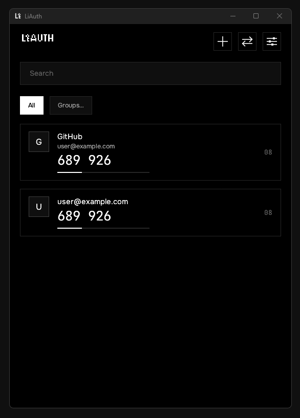
  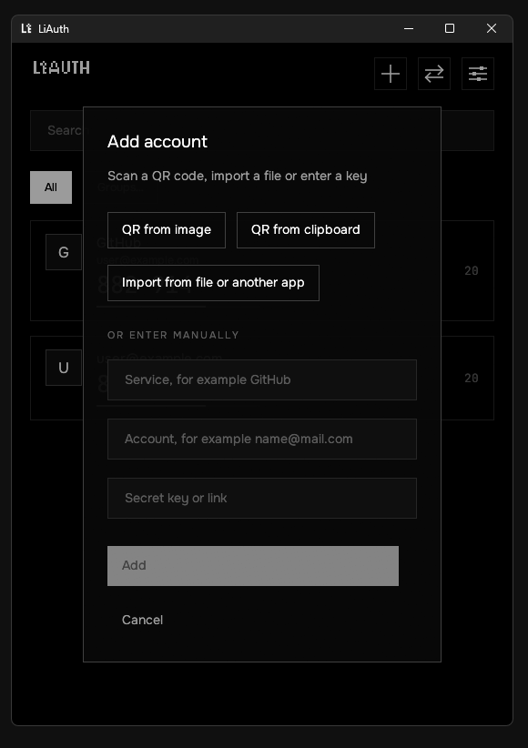
  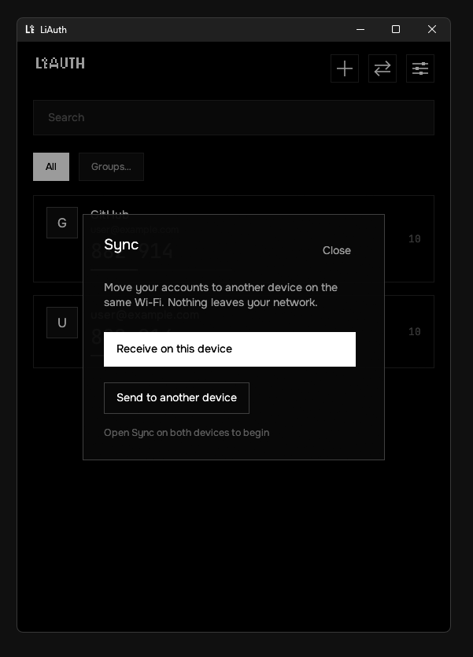
  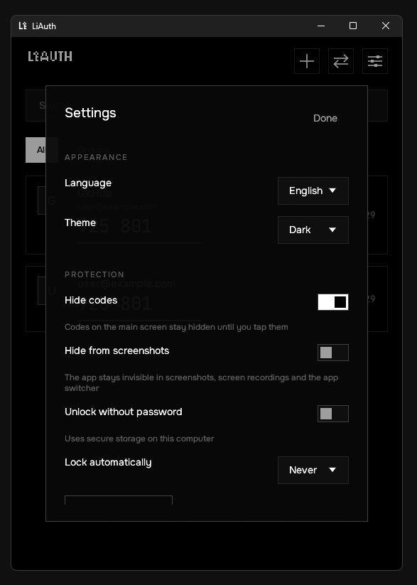
</p>

### macOS

<p>
  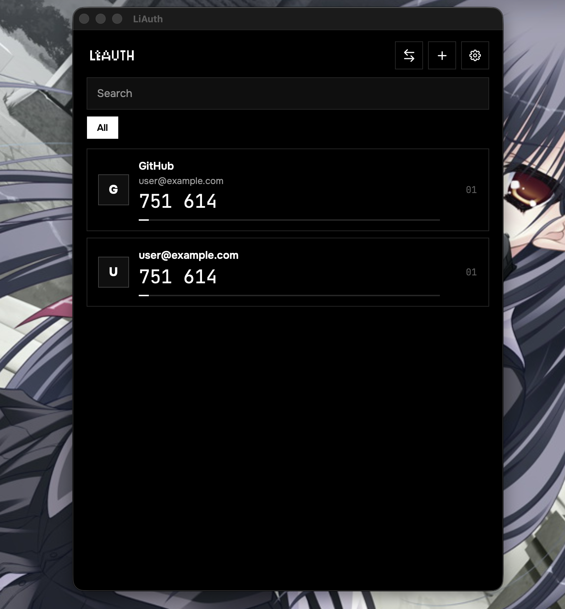
  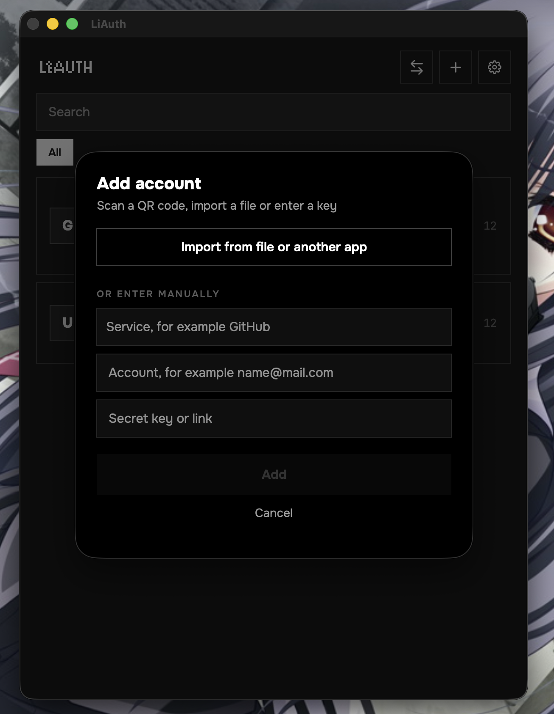
</p>
<p>
  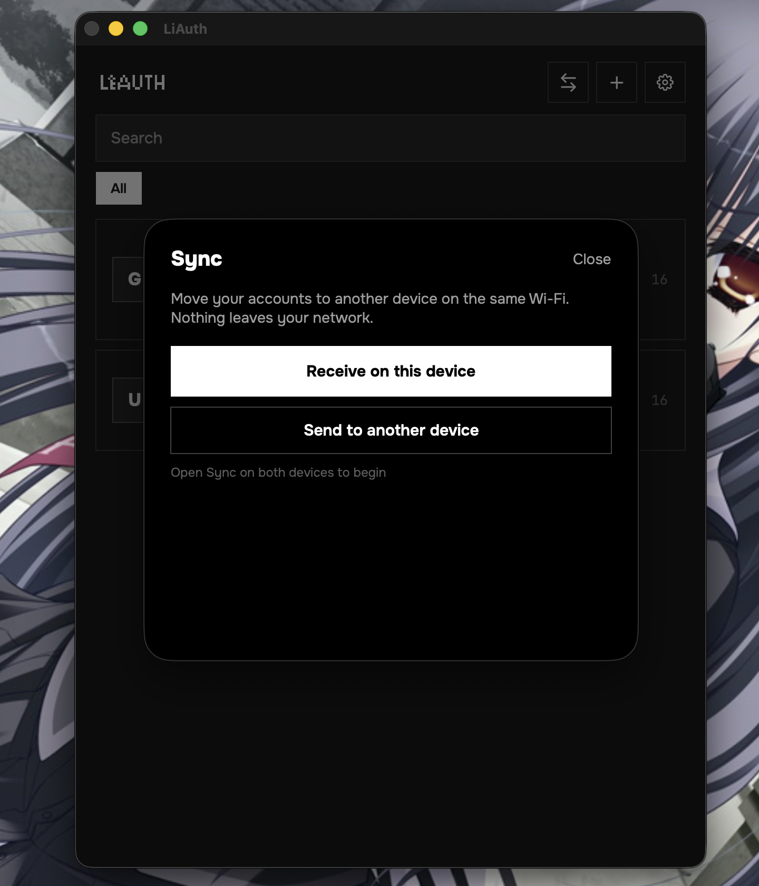
  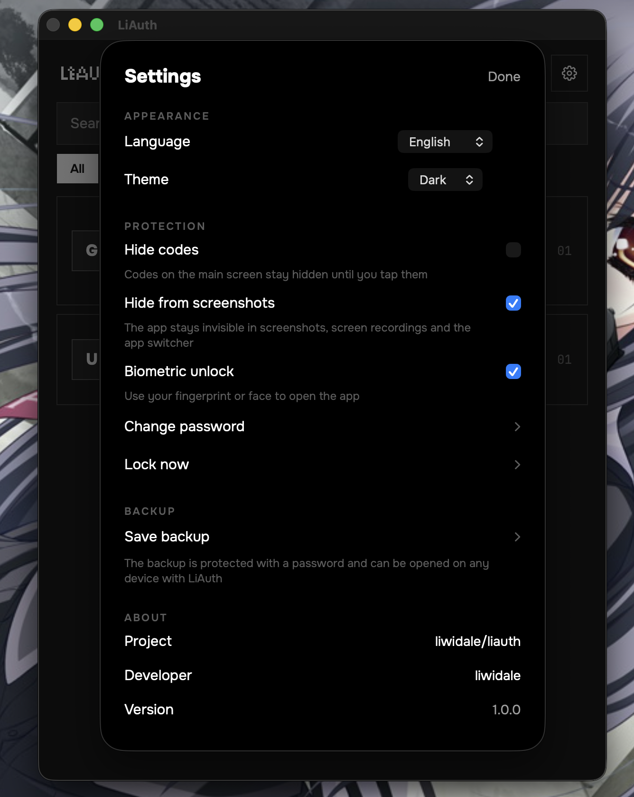
</p>

## 架构

所有业务逻辑都用 Rust 编写，并由所有平台共享：

```
liauth
├── core/
│   ├── liauth-core      验证码（TOTP、HOTP、Steam）、otpauth URI、搜索、SNTP
│   ├── liauth-crypto    AES-256-GCM 信封、Argon2id 密钥派生、密钥槽
│   ├── liauth-vault     加密保险库、分组、设置、备份、合并
│   ├── liauth-import    Google Authenticator、Aegis、2FAS、Authy 导入器
│   ├── liauth-sync      本地同步：mDNS 发现 + SPAKE2 配对
│   └── liauth-ffi       面向 Kotlin 和 Swift 的 uniffi 绑定
├── windows/             Windows 应用（Rust + egui）
├── android/             Android 应用（Kotlin + Jetpack Compose）
├── apple/               iOS 和 macOS 应用（Swift + SwiftUI、XcodeGen）
├── localization/        共享的 JSON 语言文件（en、ru、de、es、fr、zh）
├── branding/            标志与应用识别配置
└── scripts/             图标生成与工具
```

保险库是单个加密文件。随机的 256 位数据密钥加密内容；该数据密钥由一个或多个*密钥槽*封装：你的密码（经 Argon2id）以及可选的、存放在平台安全硬件中用于生物识别解锁的设备密钥。修改密码会重新封装保险库并吊销所有设备密钥槽。

## 获取应用

每个[发布版本](https://github.com/liwidale/liauth/releases)都附带预编译文件：Android 的 `.apk`、macOS 的 `.dmg`、iOS 的 `.ipa` 和 Windows 的 `.exe`。

macOS 和 Windows 构建没有使用付费开发者证书签名，因此系统在首次打开时可能显示警告。对于没有商业签名身份的开源软件来说这是正常现象。如果你不想依赖下载的二进制文件，可以按下文说明从源码构建——发布版的校验和可用于验证下载内容。

## 从源码构建

### 前置条件

- Rust 1.85+（`rustup`）
- Android：JDK 17、Android SDK + NDK、`cargo-ndk`（`cargo install cargo-ndk`）
- iOS / macOS：Xcode 15+、[XcodeGen](https://github.com/yonaskolb/XcodeGen)（`brew install xcodegen`）

### 内核

```sh
cargo test --workspace
```

### Windows

```sh
cargo build --release -p liauth-windows
# target/release/LiAuth.exe
```

### Android

```sh
cd android
gradle assembleRelease
# app/build/outputs/apk/release/app-release.apk
```

Gradle 构建会通过 `cargo-ndk` 为所有 Android ABI 编译 Rust 内核，并自动生成 Kotlin 绑定。

### iOS 和 macOS

```sh
bash apple/scripts/build-xcframework.sh
cd apple
xcodegen generate
open LiAuth.xcodeproj
```

构建 `LiAuth-iOS` 或 `LiAuth-macOS` 方案。

## 本地化

语言文件以扁平 JSON 的形式存放在 [`localization/`](localization)（`en.json`、`ru.json`、`de.json`、`es.json`、`fr.json`、`zh.json`）。添加语言的方法：

1. 把 `en.json` 复制为 `<代码>.json`（例如 `it.json`）。
2. 翻译各个值，并把 `language.name` 设为该语言的自称。
3. 提交 pull request，或把文件放进设备上应用的 `languages` 文件夹——它会立即出现在设置中，无需重新构建。

## 品牌

所有视觉素材由 [`branding/`](branding) 中的两个文件驱动，替换它们即可为整个项目重新贴牌：

```
branding/logo.png        1024 x 1024，PNG，透明背景 — 应用标志
branding/text.png        透明背景上的白色 PNG        — LiAuth 字标
```

标志用于生成 Android 启动器图标、Apple 图标集、Windows 可执行文件图标和应用内素材；字标显示在主屏幕和锁定屏幕上。两者都在运行时着色，因此透明底白色的源文件会自动适配浅色和深色主题。

替换文件后，运行 `bash scripts/generate-icons.sh`（需要 ImageMagick）重新生成各平台图标，或直接推送——CI 会自动完成。路径声明在 [`branding/branding.json`](branding/branding.json) 中。

## 安全模型

- 静态数据以 AES-256-GCM 加密；密钥用 Argon2id 派生（桌面端 64 MiB / 3 次迭代，手机端使用移动优化参数）。
- 密钥材料使用后在内存中清零。
- 本地同步通过一次性 6 位代码用 SPAKE2 配对设备，经 HKDF-SHA256 派生会话密钥，并用 AES-256-GCM 加密每一帧。代码错误会中止会话；每个代码只能使用一次。
- 备份是自包含的加密信封，与保险库采用相同构造。
- 没有遥测、没有分析，除了你明确启动的本地同步外没有任何网络访问。

发现漏洞？请在 GitHub 上提交私密安全公告，而不是公开 issue。

## 开发

```sh
cargo fmt --all            # 格式化
cargo clippy --workspace --all-targets -- -D warnings
cargo test --workspace     # 70 个单元测试，包括 RFC 4226/6238 测试向量
```

仓库自带 `.editorconfig`、`rustfmt.toml` 和 CI，在每次推送时强制执行格式化、静态检查和测试。

## 链接

- 项目：[github.com/liwidale/liauth](https://github.com/liwidale/liauth)
- 开发者：[github.com/liwidale](https://github.com/liwidale)

## 许可证

[MIT](LICENSE) — 可自由使用、修改和分发。
